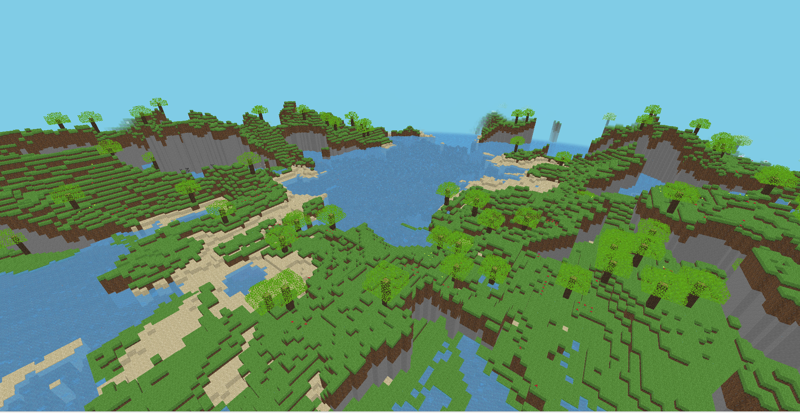

# AvaMc

Trans from [Minecraft, but I made it in 48 hours.](https://github.com/jdah/minecraft-weekend)

Using [Avalonia](https://github.com/AvaloniaUI/Avalonia) and [Silk.Net.OpenglES](https://github.com/dotnet/Silk.NET/tree/main/src/OpenGL/Silk.NET.OpenGLES).

---

> # Minecraft, but I made it in 48 hours.
>
> 
>
> ##### Features:
> - Infinite, procedurally generated world
> - "Biomes"
> - Full transparency + translucency support
> - Sprite blocks (flowers)
> - Animated blocks (water + lava)
> - Distaince fog
> - Blocks
>   - Grass
>   - Dirt
>   - Stone
>   - Sand
>   - Water
>   - Glass
>   - Log
>   - Leaves
>   - Rose
>   - Buttercup
>   - Coal
>   - Copper
>   - Lava
>   - Clay
>   - Gravel
>   - Planks
